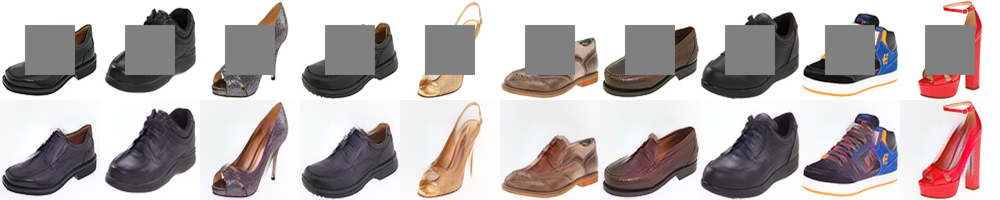

# 1 Introduction

This repo contains code to reproduce the results presented in [https://arxiv.org/abs/1611.05507](https://arxiv.org/abs/1611.05507).

```latex
@inproceedings{upchurch2017deep,
  title={{D}eep {F}eature {I}nterpolation for Image Content Changes},
  author={Upchurch, Paul and Gardner, Jacob and Pleiss, Geoff and Pless, Robert and Snavely, Noah and Bala, Kavita and Weinberger, Kilian},
  booktitle={Computer Vision and Pattern Recognition (CVPR)},
  year={2017}
}
```

# 2 Demonstrations

## 2.1 Demo1


This script produces six kinds of transformations on LFW faces at a resolution of 200x200. Images will be automatically downloaded.

## 2.2 Demo2


This script ages or adds facial hair to a front-facing portrait at resolutions up to 1000x1000. Follow the directions in [datasets/facemodel/sources.txt](../datasets/facemodel/sources.txt) to prepare the image database. 

## 2.3 Demo3



This script fills in missing portions of shoe images. You will need to acquire the [UT Zappos50K](http://vision.cs.utexas.edu/projects/finegrained/utzap50k/) images.

# 3 Options

## 3.1 Reconstruction backend (--backend)

We have two backends. Caffe+SciPy uses Caffe to forward/backward VGG
(GPU) then uses SciPy to call the FORTRAN implementation of L-BFGS-B
(CPU). Torch uses PyTorch to do the entire reconstruction on the
GPU. Torch is faster than Caffe+SciPy but it produces a lower-quality
result. We set Caffe+SciPy to be default for the LFW and UT-Zappos50K
demonstrations and Torch to be the default for the high-res face
demonstration.

# 4 Contents

demo1.py: Transforms LFW faces.

demo2.py: Transforms high-resolution faces.

demo3.py: Inpaints UT-Zappos50K shoes.

images/lfw_aegan: Cropped and aligned LFW images (automatically downloaded
by demo1.py)

datasets/facemodel/sources.txt: Instructions for preparing the
high-resolution database for demo2.py.

datasets/utzap/vggpool5.200x200_A.npz: Precomputed nearest neighbors
for UT-Zappos50K (automatically downloaded by demo3.py)

datasets/test/sources.txt: URLs for the high-res images in the paper.

datasets/test/masks: Masks for the high-res images in the paper.

models/facemodel: Face attribute predictor.

models/VGG_CNN_19: Caffe model for normalized VGG-19.

~/.torch/models/vgg19g-4aff041b.pth: Torch model for normalized VGG-19 (automatically downloaded).

